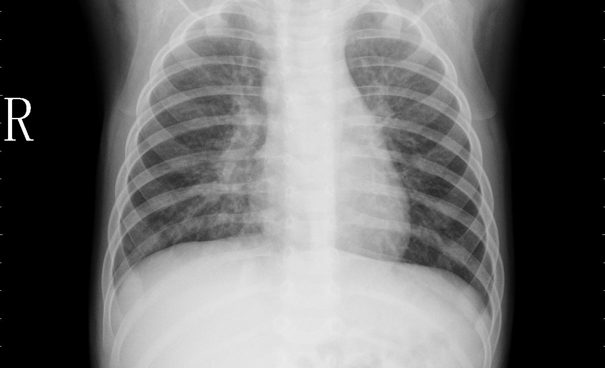
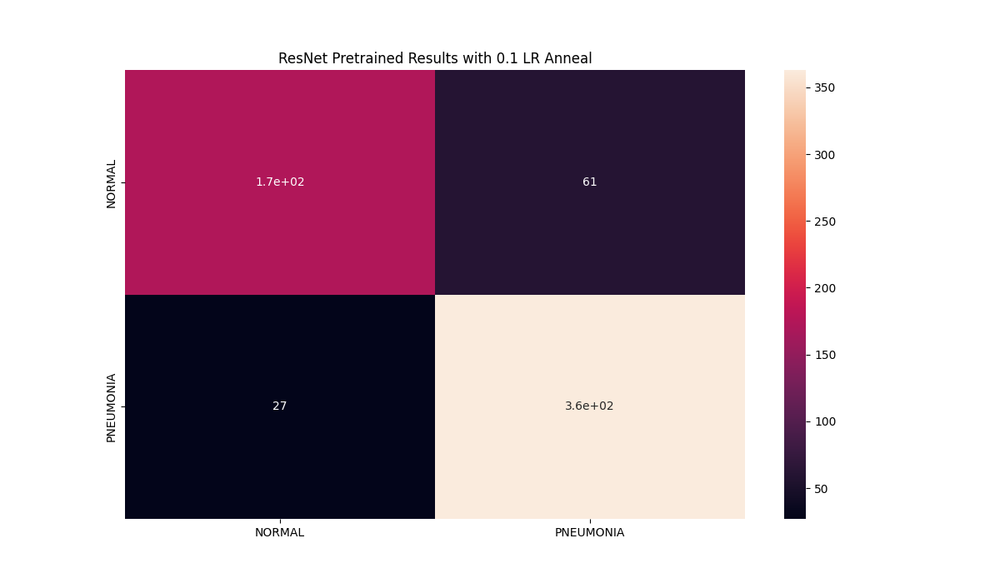

<h1> Chest X-Ray Pneumonia Detection in PyTorch </h1>
This repository solves the problem of Pneumonia Chest Xray detection using PyTorch
<br>




```Inference on Single Image on Local Machine``` <br>

Run ```server2.py``` on Local Terminal <br>
On another terminal run <br>

```curl -X POST  http://127.0.0.1:5000/ -H 'Content-Type: application/json' -d '{"file":"/Users/sarath_computer_vision/Documents/pneumonia/test_nor.jpeg"}'```

<br>


```Dataset```
Available at <html>https://www.kaggle.com/paultimothymooney/chest-xray-pneumonia
<br>
```dataset.py``` contains Dataset class in pytorch to load data <br>
```transforms.py``` contains Transforms for train and val/test images <br>
```train.py``` contains the model and trains for specified epochs <br>
```main.py``` Loads the argparser and starts the training by calling ```train.py``` <br>
  ```test.py``` Return the confusion matrix and accuracy on a test set <br>
  ```requirements.txt``` contains libraries in the python environment where experiments ran <br>
  ```tensorboard.txt``` contains links for experimental results of 4 Models
<br>

Train the model for specified epochs
``````
python3 main.py --batchSize=32 --lr=0.01 --endEpoch=30 --lrRateAnnealing=0.7 --experimentName='ResNetTruePretrain70Anneal' --pretrained

``````
<br>

Test the model on a dataset
```
python3 test.py --model_path='./best_models/rs10_model_2_32_79.17_0.8125_0.64_0.0001_.pth' --test_data_path='./Data/test' --cmatrix_name='ResScratch10.png'
```

<h3> Report of the Paper is also available in the directory </h3>
  

<h3> Please feel free to raise issues and star the repo if useful </h3>
